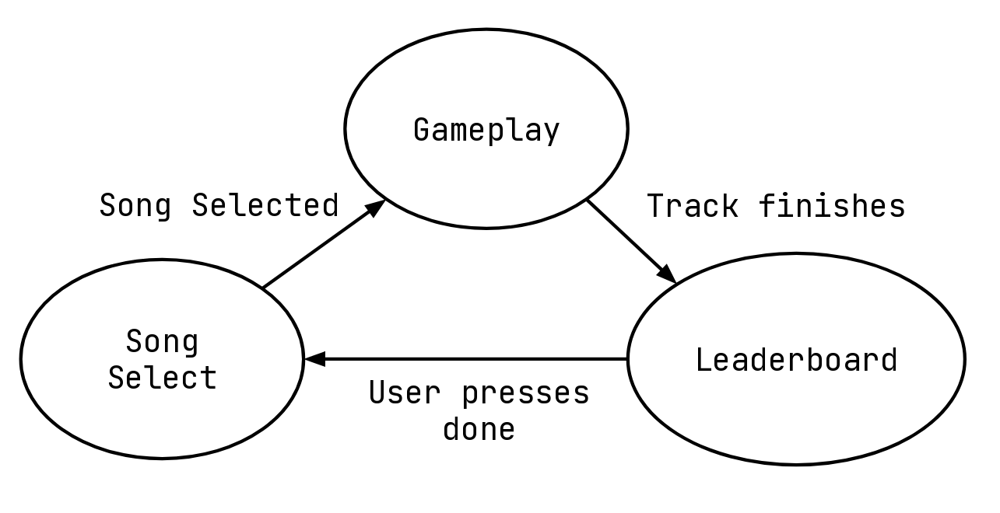
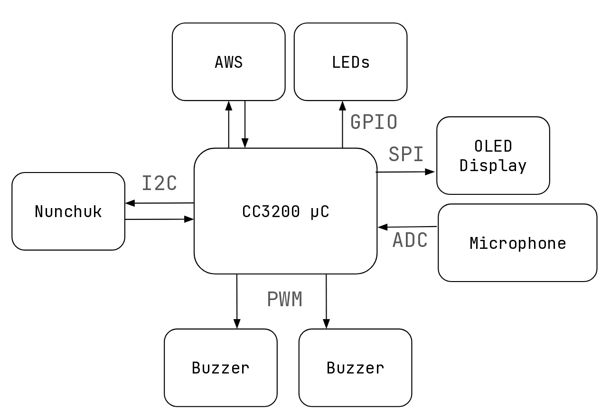
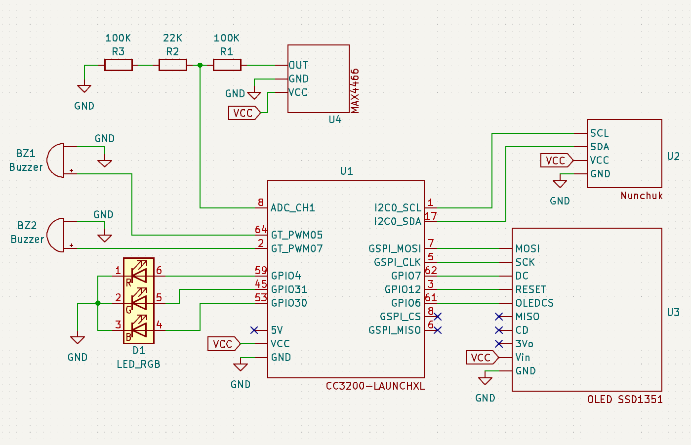

# Bugle Champ!
Luna Park & Victoria Lam

## Project Description
The prototype developed in this project is a rhythm game where players use a Nintendo Nunchuk to control the pitch and timing of an on-screen bugle. Similarly to other rhythm games, it includes a song selection menu and a leaderboard for each track. The gameplay cycles through three main stages: song selection, the main game, and leaderboard display. During the main game, players aim to match their pitch and timing as closely as possible to the prescribed notes, or beatmap, in order to earn a high score.

Visually and sonically, the game draws inspiration from retro arcade aesthetics, while its core mechanics are based on the rhythm game Trombone Champ. This project builds upon Trombone Champ by replacing mouse-based pitch control with the Nintendo Nunchuk and introducing an optional microphone input for controlling note timing through blowing.

## Video Demo
<iframe width="560" height="315" src="https://www.youtube.com/embed/wubIUXXSRbA?si=0LxykFJFqGcmzSU8" title="YouTube video player" frameborder="0" allow="accelerometer; autoplay; clipboard-write; encrypted-media; gyroscope; picture-in-picture; web-share" referrerpolicy="strict-origin-when-cross-origin" allowfullscreen></iframe>

## Design

### Functional Specification




The game cycles through three states: title screen and song select, main game, and leaderboard display. The specific version of the game depends on the song selected. Gameplay is mostly offline, but leaderboard display requires Wi-Fi to access AWS.

### System Architecture


The CC3200 board acts as the master for all peripherals:

* **AWS**: Stores the leaderboard
* **Buzzers**: Play backing track and bugle sound
* **LEDs**: Indicate score and errors
* **Microphone**: Detects blowing input (optional control method)
* **Nunchuk**: Provides accelerometer and button data
* **OLED Display**: Displays UI, note timing, and score

---

## Implementation
### Circuit Diagram



### Reading Nunchuk Data

The Nintendo Nunchuk is connected to I2C0. The connection involves wiring VCC, GND, SCK, and SDA. I2C is configured using:

```c
I2C_IF_Open(I2C_MASTER_MODE_STD);
```

A handshake sequence is required:

* Write `0x55` to register `0xF0`
* Write `0x00` to register `0xFB`
* Then, to request data: write `0x00`, delay 3ms, read 6 bytes

The data is parsed into:

```c
typedef struct {
    uint8_t joystick_x;
    uint8_t joystick_y;
    uint8_t accel_x_high;
    uint8_t accel_y_high;
    uint8_t accel_z_high;
    uint8_t button_z   : 1;
    uint8_t button_c   : 1;
    uint8_t accel_x_low : 2;
    uint8_t accel_y_low : 2;
    uint8_t accel_z_low : 2;
} NunchukData;
```

On communication failure (3 attempts), the game pauses and the LED shows RED until the Nunchuk reconnects.

### Reading Microphone Data

The MAX4466 microphone is biased at 1.65V due to 3.3V VCC, which is too high for the CC3200's ADC range (up to \~1.45V). A voltage divider is used to reduce this:

* 100kΩ from GND to ADC pin
* 100kΩ + 22kΩ in series from ADC pin to mic output

This gives about 0.6525V bias and max \~1.485V input.

In software, if ADC reads above threshold `0xB00`, it detects blowing.

### Reading Background Track Notes

Songs are stored in memory as arrays of this struct:

```c
typedef struct {
    int note_frequency;
    int start_ms;
    int length_ms;
} Note;
```

`start_ms` is relative to the start of the song.
`g_startTimeMS` is set using:

```c
(PRCMSlowClkCtrGet() * 1000) / 32768
```

Notes are iterated through in order. If the note is active (between start and end time), it's played on the buzzer.

### Playing Frequencies on Passive Buzzers

Buzzers are connected to PWM pins. PWM timers are initialized and configured with the desired frequency. The 80 MHz clock limits the minimum frequency without prescale, so a prescaler is used to achieve frequencies as low as 4.77 Hz.

### Drawing Sprites

Sprites were made in **GIMP 3.0.2**, exported as C structs:

```c
typedef struct {
    unsigned int width;
    unsigned int height;
    const unsigned char *pixel_data;
} Sprite;
```

A `DrawSprite()` function handles rendering by coordinates.

### Title Screen

On startup:

* A full-screen menu sprite is drawn
* Background music plays via both buzzers
* Song name and artist are displayed

Input is detected via joystick. Up/down selects songs; Z button starts the game.


### Gameplay Loop

When gameplay starts:

* The OLED is cleared
* Hatsune Miku and her bugle are drawn
* `g_startTimeMS` is set

Loop:

1. Read from Nunchuk and microphone
2. Apply low-pass filter to Z-accelerometer to determine pitch
3. Draw bugle at corresponding position
4. Play a note if blown into or Z button is pressed
5. Play backing track from note array
6. Draw falling notes (next 1.5 seconds shown on screen)

Scoring:

* Must be within 5 semitones of the note
* Must press within ±150 ms of start and release within ±150 ms of end
* More points if within ±75 ms
* Only one press-release allowed per note


### Leaderboard

Stored in AWS Device Shadow as JSON string values.

After a song ends:

* HTTP GET retrieves the leaderboard
* If the player qualifies for top 5:

  * Prompt for name input
  * New leaderboard is constructed and posted via HTTP PUT

## Bill of Materials

* **CC3200 LaunchPad**: provided by lab
* **Micro-USB to USB-A cable**: provided by lab
* **Adafruit OLED Breakout Board**: provided by lab
* **Nintendo Wii Nunchuk**: \~\$10
* **Nunchuk Breakout Board**: \~\$3.50
* **2 passive buzzers**: \$0.69 each (DigiKey)
* **MAX4466 with Microphone**: \~\$2
* **Tricolor LED**: \~\$1


## Track Arrangement Credits
All tracks are based on arrangements of existing songs, which have then been modified to play on two buzzers.

### Title Screen - Miracle Paint by OSTER project 
Based on arrangement by user Musesc0rer on musescore

Arrangement: [https://musescore.com/user/941151/scores/1475131](https://musescore.com/user/941151/scores/1475131)

User Profile: [https://musescore.com/user/941151](https://musescore.com/user/941151)


### Track 1: Toreador March by Georges Bizet
Based on arrangement by user NECROMANCER on onlinesequencer.net

Arrangement: [https://onlinesequencer.net/1347793](https://onlinesequencer.net/1347793)


User Profile: [https://onlinesequencer.net/members/36567](https://onlinesequencer.net/members/36567)

### Track 2: Ditto by NewJeans
Based on arrangement by user blueberrieszn IS BACK on musescore 

Arrangement: [https://musescore.com/user/36964839/scores/9351625](https://musescore.com/user/36964839/scores/9351625)


User Profile: [https://musescore.com/user/36964839](https://musescore.com/user/36964839)


### Track 3: World is Mine by ryo (supercell) 
Based on arrangement by user legend57961 on musescore

Arrangement: [https://musescore.com/user/235731/scores/237176](https://musescore.com/user/235731/scores/237176)

User Profile:[https://musescore.com/user/235731](https://musescore.com/user/235731)

